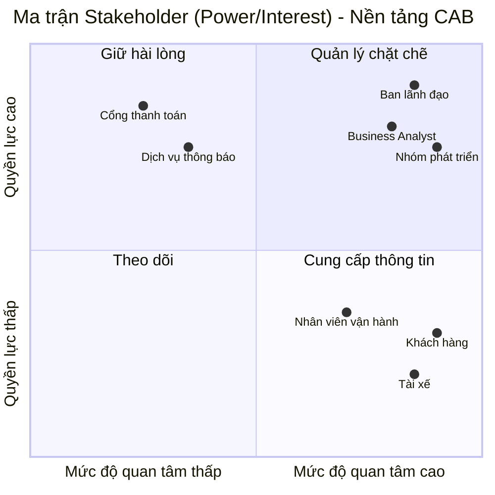

**Danh sách Stakeholders (Các bên liên quan) - Nền tảng đặt xe CAB**

| Tên | Vai trò |
| :--- | :--- |
| **Ban lãnh đạo / Ban giám đốc** | Người ra quyết định chiến lược và đầu tư nền tảng. Có nhu cầu xem các báo cáo tổng quan (doanh thu, số lượng chuyến, tỷ lệ hoàn thành/hủy, hiệu suất) và định hướng mở rộng hệ thống trong tương lai. |
| **Khách hàng** | Người dùng cuối sử dụng hệ thống để đăng ký/đăng nhập, tạo yêu cầu đặt xe, theo dõi hành trình, thanh toán cước phí và đánh giá tài xế sau chuyến đi. |
| **Tài xế** | Đối tác cung cấp dịch vụ vận chuyển. Sử dụng ứng dụng để nhận/từ chối yêu cầu đặt xe, chia sẻ vị trí liên tục và cập nhật các trạng thái của chuyến đi (đã đến, đã đón khách, hoàn thành). |
| **Nhân viên vận hành** | Quản lý dữ liệu hệ thống (khách hàng, tài xế, phương tiện). Giám sát các chuyến đi đang diễn ra, hỗ trợ xử lý ngoại lệ/lỗi và tra cứu lịch sử giao dịch thông qua phân quyền. |
| **Business Analyst (BA)** | Người phân tích và thiết kế hệ thống. Chịu trách nhiệm xác định phạm vi, quy trình nghiệp vụ, các trường hợp ngoại lệ và làm rõ các quy tắc nghiệp vụ chưa chốt (tính cước, tiêu chí ưu tiên, chính sách hủy) với các bên liên quan. |
| **Nhóm phát triển (Development Team)** | Chịu trách nhiệm thiết kế kiến trúc kỹ thuật linh hoạt, độc lập, có khả năng mở rộng cao và lập trình xây dựng nền tảng CAB dựa trên các yêu cầu đã được phân tích. |
| **Nhà cung cấp cổng thanh toán (Bên thứ 3)** | Đối tác xử lý các giao dịch thanh toán điện tử, đảm bảo tính bảo mật và toàn vẹn của dữ liệu thẻ/tài khoản mà không lưu trữ trực tiếp trên CAB. |
| **Nhà cung cấp dịch vụ thông báo (Bên thứ 3)** | Hệ thống bên ngoài hỗ trợ gửi các cập nhật thời gian thực (trạng thái chuyến đi, thanh toán) tới thiết bị của khách hàng và tài xế. |

**Ma trận Stakeholder (Power/Interest Grid) - Nền tảng CAB**

| | Mức độ quan tâm thấp (Low Interest) | Mức độ quan tâm cao (High Interest) |
| :--- | :--- | :--- |
| **Quyền lực cao (High Power)** | **Giữ hài lòng (Keep Satisfied)** • Nhà cung cấp cổng thanh toán • Nhà cung cấp dịch vụ thông báo | **Quản lý chặt chẽ (Manage Closely)** • Ban lãnh đạo / Ban giám đốc • Nhóm phát triển (Development Team) • Business Analyst (BA) |
| **Quyền lực thấp (Low Power)** | **Theo dõi (Monitor)** *(Hiện chưa có đối tượng nổi bật ở nhóm này trong phạm vi tài liệu)* | **Cung cấp thông tin (Keep Informed)** • Khách hàng • Tài xế • Nhân viên vận hành |

**Chi tiết chiến lược tiếp cận từng nhóm:**

* **Quản lý chặt chẽ (High Power - High Interest):** Đây là nhóm quyết định sự thành bại của dự án. Ban lãnh đạo cần duyệt yêu cầu, ngân sách và theo dõi tiến độ. BA và Dev Team là nòng cốt thực thi, cần tương tác liên tục, họp bàn giao và giải quyết vấn đề kỹ thuật/nghiệp vụ hàng ngày.
* **Giữ hài lòng (High Power - Low Interest):** Các đối tác cung cấp API (thanh toán, thông báo) không quan tâm nhiều đến chiến lược kinh doanh của CAB, nhưng hệ thống phụ thuộc hoàn toàn vào dịch vụ của họ. Cần tuân thủ đúng tài liệu kỹ thuật (guidelines) của họ và duy trì kết nối ổn định.
* **Cung cấp thông tin (Low Power - High Interest):** Khách hàng, tài xế và nhân viên vận hành bị ảnh hưởng trực tiếp bởi hệ thống mới nhưng không có quyền quyết định tính năng. Cần thu thập ý kiến, đào tạo sử dụng và cập nhật thông báo rõ ràng cho họ khi hệ thống ra mắt.
* **Theo dõi (Low Power - Low Interest):** Giám sát tối thiểu. Trong tương lai có thể là các cơ quan quản lý giao thông địa phương nếu họ yêu cầu báo cáo định kỳ nhưng chưa có tác động trực tiếp ở giai đoạn hiện tại.

**Biểu đồ Ma trận Stakeholder (Mermaid Quadrant Chart)**

# Business Rules – CAB System MVP

## 1. Quy tắc tài khoản và phân quyền

| Mã | Business Rule |
|---|---|
| **BR-01** | Khách hàng và tài xế phải được xác thực trước khi sử dụng các chức năng yêu cầu tài khoản. |
| **BR-02** | Chỉ người dùng có quyền phù hợp mới được thực hiện các thao tác quản trị. |
| **BR-03** | Thông tin cá nhân của khách hàng và tài xế phải được bảo vệ. |

---

## 2. Quy tắc đặt xe

| Mã | Business Rule |
|---|---|
| **BR-04** | Một yêu cầu đặt xe phải có điểm đón, điểm đến và loại xe. |
| **BR-05** | Sau khi khách hàng gửi yêu cầu, hệ thống phải chuyển yêu cầu sang trạng thái tìm tài xế. |
| **BR-06** | Khách hàng phải được thông báo về trạng thái xử lý yêu cầu đặt xe. |

---

## 3. Quy tắc tìm và phân công tài xế

| Mã | Business Rule |
|---|---|
| **BR-07** | Hệ thống chỉ xem xét các tài xế đang ở trạng thái sẵn sàng nhận chuyến. |
| **BR-08** | Tài xế được lựa chọn phải phù hợp với loại xe mà khách hàng yêu cầu. |
| **BR-09** | Hệ thống phải ưu tiên tài xế phù hợp và gần điểm đón của khách hàng. |
| **BR-10** | Nếu tài xế được đề xuất không phản hồi hoặc từ chối chuyến, hệ thống phải tiếp tục tìm tài xế khác. |
| **BR-11** | Nếu không tìm được tài xế phù hợp, hệ thống phải thông báo cho khách hàng. |
| **BR-12** | Khi tài xế chấp nhận chuyến, hệ thống phải ghi nhận tài xế được phân công cho chuyến đó. |

---

## 4. Quy tắc thực hiện chuyến

| Mã | Business Rule |
|---|---|
| **BR-13** | Tài xế phải cập nhật trạng thái chuyến trong quá trình thực hiện. |
| **BR-14** | Các trạng thái chính của chuyến gồm: tìm tài xế, đã phân công tài xế, tài xế đến điểm đón, đã đón khách, đang di chuyển và hoàn thành. |
| **BR-15** | Khi chuyến hoàn thành, hệ thống phải ghi nhận thông tin chuyến để phục vụ tính cước, thanh toán và lưu lịch sử. |
| **BR-16** | Hệ thống phải lưu thông tin vị trí của tài xế để hỗ trợ tìm tài xế và dự kiến thời gian đến. |

---

## 5. Quy tắc tính cước và thanh toán

| Mã | Business Rule |
|---|---|
| **BR-17** | Sau khi chuyến hoàn thành, hệ thống phải xác định số tiền khách hàng phải trả dựa trên loại dịch vụ và thông tin chuyến đi. |
| **BR-18** | Khách hàng được phép thanh toán bằng tiền mặt hoặc phương thức thanh toán điện tử được hệ thống hỗ trợ. |
| **BR-19** | Thông tin nhạy cảm của thẻ hoặc tài khoản thanh toán không được lưu trực tiếp trong hệ thống CAB. |
| **BR-20** | Thanh toán điện tử phải được xử lý thông qua nhà cung cấp dịch vụ thanh toán bên ngoài. |
| **BR-21** | Khi thanh toán điện tử thất bại, hệ thống phải thông báo cho khách hàng và cho phép xử lý lại theo chính sách của doanh nghiệp. |

---

## 6. Quy tắc thông báo

| Mã | Business Rule |
|---|---|
| **BR-22** | Khách hàng phải được thông báo khi yêu cầu đặt xe được tiếp nhận. |
| **BR-23** | Khách hàng phải được thông báo khi tài xế nhận chuyến. |
| **BR-24** | Khách hàng phải được thông báo khi tài xế đến điểm đón. |
| **BR-25** | Khách hàng phải được thông báo khi chuyến xe hoàn thành và khi thanh toán có kết quả. |
| **BR-26** | Tài xế phải được thông báo khi có chuyến mới hoặc có thay đổi liên quan đến chuyến đang thực hiện. |

---

## 7. Quy tắc vận hành

| Mã | Business Rule |
|---|---|
| **BR-27** | Nhân viên vận hành được phép theo dõi các chuyến đang diễn ra và trạng thái tài xế theo quyền được cấp. |
| **BR-28** | Nhân viên vận hành được phép hỗ trợ xử lý các trường hợp chuyến bị lỗi theo chính sách của doanh nghiệp. |
| **BR-29** | Các thao tác quản trị quan trọng phải được lưu vết để phục vụ kiểm tra và xử lý sự cố. |

---

# Business Rules cần xác nhận

Các quy tắc dưới đây chưa được xác định cụ thể trong yêu cầu hiện tại. Cần trao đổi với khách hàng hoặc Ban giám đốc trước khi triển khai chính thức.

| Mã | Nội dung cần xác nhận |
|---|---|
| **BR-Q01** | Bán kính tối đa để hệ thống tìm kiếm tài xế là bao nhiêu? |
| **BR-Q02** | Tài xế có bao nhiêu thời gian để phản hồi yêu cầu chuyến? |
| **BR-Q03** | Sau khi tài xế từ chối hoặc không phản hồi, hệ thống chuyển sang tài xế tiếp theo sau bao lâu? |
| **BR-Q04** | Ngoài khoảng cách, hệ thống có tiêu chí nào khác để ưu tiên tài xế không? |
| **BR-Q05** | Công thức tính cước chuyến xe cụ thể là gì? |
| **BR-Q06** | Có áp dụng phụ phí theo thời điểm, quãng đường, loại xe hoặc điều kiện khác không? |
| **BR-Q07** | Khách hàng có được phép hủy chuyến không và có phát sinh phí hủy không? |
| **BR-Q08** | Nếu tài xế hủy chuyến sau khi đã nhận, hệ thống có tự động tìm tài xế khác không? |
| **BR-Q09** | Khi thanh toán điện tử thất bại, khách hàng được phép thanh toán lại bao nhiêu lần? |
| **BR-Q10** | Khi mất kết nối mạng hoặc GPS, hệ thống xử lý trạng thái chuyến và vị trí tài xế như thế nào? |

---

# Tổng kết Business Rules

| Loại | Số lượng | Phạm vi |
|---|---:|---|
| Business Rules chính thức | **29** | Sử dụng cho MVP |
| Business Rules cần xác nhận | **10** | Cần thống nhất với khách hàng |
| **Tổng cộng** | **39** | Bao gồm cả nội dung cần xác nhận |

> **Lưu ý:** BR-Q01 đến BR-Q10 chưa được xem là Business Rule chính thức của hệ thống. Sau khi khách hàng xác nhận, các nội dung này mới được chuẩn hóa thành Business Rule chính thức và đánh số lại nếu cần.

**Module Quản lý Khách hàng (MVP)**
* **Xác thực cơ bản:** Đăng ký và đăng nhập nhanh bằng số điện thoại.
* **Đặt xe (Luồng cốt lõi):** Cho phép nhập điểm đón và điểm đến qua API bản đồ; hệ thống hiển thị cước phí dự kiến dựa trên công thức tĩnh (tổng quãng đường x đơn giá).
* **Theo dõi hành trình:** Cập nhật theo thời gian thực 4 trạng thái chính yếu: Đang tìm tài xế $\rightarrow$ Tài xế đang đến $\rightarrow$ Đang di chuyển $\rightarrow$ Hoàn thành.
* **Thanh toán tối giản:** Triển khai thanh toán bằng tiền mặt (Cash) và tối đa một cổng thanh toán điện tử cơ bản để ghi nhận luồng tiền.
* **Ngoài phạm vi MVP (Out of scope):** Đánh giá tài xế, lưu địa chỉ yêu thích, mã khuyến mãi, phân hạng thành viên.

**Module Quản lý Tài xế (MVP)**
* **Quản lý hồ sơ tối giản:** Bỏ qua quy trình tự đăng ký phức tạp. Tài khoản tài xế có thể do nhân viên vận hành tạo và cấp quyền trực tiếp để nhanh chóng đưa vào hoạt động.
* **Cập nhật trạng thái làm việc:** Cung cấp duy nhất nút bật/tắt trạng thái sẵn sàng (Online/Offline) và liên tục gửi tọa độ GPS về hệ thống.
* **Thuật toán phân công (Dispatching) cơ bản:** Sử dụng cơ chế tìm kiếm theo bán kính địa lý gần nhất (ví dụ: quét các tài xế trống trong bán kính 2km) hoặc cơ chế Broadcast (phát đồng loạt). Bỏ qua hoàn toàn các tham số ưu tiên về tỷ lệ nhận chuyến, điểm đánh giá hay thâm niên.
* **Thực thi chuyến đi:** Giao diện thao tác một chạm để tài xế cập nhật luồng trạng thái: Chấp nhận chuyến $\rightarrow$ Đã đến điểm đón $\rightarrow$ Bắt đầu hành trình $\rightarrow$ Kết thúc chuyến.
* **Ngoài phạm vi MVP (Out of scope):** Điểm đánh giá (Rating), hệ thống thưởng/phạt (Penalty), ví nội bộ phức tạp, xem thống kê hiệu suất tài xế.

**Danh sách Yêu cầu Nghiệp vụ (Business Requirements) - Lựa chọn Xe & Tài xế (MVP)**

| Mã BR | Hạng mục | Mô tả yêu cầu cho giai đoạn MVP |
| :--- | :--- | :--- |
| **BR-01** | **Lựa chọn loại phương tiện cơ bản** | Khách hàng chỉ được cung cấp các tùy chọn phân loại xe thiết yếu nhất để đáp ứng nhu cầu vận chuyển (ví dụ: Xe 4 chỗ tiêu chuẩn, Xe 7 chỗ tiêu chuẩn). Hệ thống không xử lý các bộ lọc phức tạp (xe hạng sang, xe điện, xe ghép) nhằm đơn giản hóa công thức tính cước và logic tìm kiếm. |
| **BR-02** | **Cơ chế ghép nối tài xế tự động** | Để đảm bảo hệ thống vận hành trơn tru và nhanh chóng, khách hàng không tự lướt danh sách để chọn tài xế. Hệ thống sẽ tự động quét và chỉ định tài xế đang ở trạng thái "Sẵn sàng" có vị trí địa lý gần điểm đón nhất. |
| **BR-03** | **Hiển thị thông tin tài xế rút gọn** | Sau khi hệ thống ghép nối thành công, giao diện khách hàng chỉ hiển thị các thông tin định danh bắt buộc: Tên tài xế, số điện thoại, biển số xe và vị trí GPS trên bản đồ. Không thu thập, không tính toán và không hiển thị các dữ liệu đánh giá chất lượng (Rating, thâm niên, số huy hiệu). |
| **BR-04** | **Tự động xử lý luồng từ chối chuyến** | Nếu tài xế được hệ thống lựa chọn từ chối yêu cầu hoặc không phản hồi trong thời gian quy định (ví dụ: 15 giây), hệ thống tự động chuyển yêu cầu đặt xe tới tài xế gần thứ hai. Khách hàng không cần thao tác chọn lại xe hay tạo lại cuốc xe từ đầu. |
