# PHÂN TÍCH NGHIỆP VỤ CAB SYSTEM – MVP

> **Cơ sở phân tích:** tài liệu yêu cầu khách hàng về dự án **CAB System – Nền tảng đặt xe**, thời gian xây dựng 7 tuần. Tài liệu xác định 3 nhóm người dùng chính là khách hàng, tài xế và nhân viên vận hành; đồng thời yêu cầu hệ thống có khả năng mở rộng về sau.
>
> **Phạm vi MVP theo đề bài:** chỉ tập trung vào **2 module chính**:
> 1. **Quản lý khách hàng**
> 2. **Quản lý tài xế**
>
> Các chức năng như thanh toán, báo cáo quản trị, đánh giá tài xế, thuật toán phân công thông minh... **chưa triển khai đầy đủ trong MVP**. Đây cũng phù hợp với tài liệu vì doanh nghiệp chưa chốt một số quy tắc chi tiết và mong muốn BA làm rõ trước khi phát triển.

---

# B1. Xác định Stakeholder

## 1. Danh sách Stakeholder

| Tên Stakeholder | Vai trò |
|---|---|
| **Khách hàng** | Người sử dụng CAB System để đăng ký tài khoản, cập nhật thông tin, tạo yêu cầu đặt xe, lựa chọn xe/tài xế và theo dõi chuyến |
| **Tài xế** | Người nhận và thực hiện chuyến; quản lý hồ sơ, phương tiện và trạng thái sẵn sàng |
| **Nhân viên vận hành** | Quản lý thông tin khách hàng, tài xế, phương tiện và hỗ trợ các trường hợp phát sinh |
| **Ban lãnh đạo / Quản lý doanh nghiệp** | Đưa ra mục tiêu kinh doanh, kiểm soát hoạt động và định hướng phát triển hệ thống |
| **Nhà cung cấp thanh toán** | Hệ thống bên ngoài hỗ trợ thanh toán điện tử; thuộc phạm vi tương lai, chưa phải trọng tâm MVP |
| **Nhà cung cấp thông báo** | Cung cấp kênh gửi thông báo; hỗ trợ khả năng mở rộng trong tương lai |
| **Business Analyst (BA)** | Thu thập, phân tích, làm rõ và chuyển đổi yêu cầu khách hàng thành yêu cầu nghiệp vụ/chức năng |
| **Nhóm phát triển** | Xây dựng hệ thống dựa trên yêu cầu đã được phân tích và phê duyệt |
| **Tester/QA** | Kiểm tra hệ thống dựa trên FR và AC; giai đoạn hiện tại chưa triển khai Test Case |

Tài liệu gốc đặc biệt xác định **khách hàng, tài xế và nhân viên vận hành** là ba nhóm người dùng chính. 

---

# B2. Stakeholder Matrix

## 1. Ma trận Power – Interest

| Stakeholder | Power | Interest | Nhóm |
|---|---:|---:|---|
| Ban lãnh đạo | Cao | Cao | **Manage Closely** |
| Nhân viên vận hành | Cao | Cao | **Manage Closely** |
| Khách hàng | Thấp | Cao | **Keep Satisfied / Keep Informed** |
| Tài xế | Thấp | Cao | **Keep Informed** |
| BA | Cao | Cao | **Manage Closely** |
| Nhóm phát triển | Trung bình | Cao | **Keep Informed** |
| Tester/QA | Trung bình | Trung bình | **Keep Informed** |
| Nhà cung cấp thanh toán | Trung bình | Thấp | **Monitor** |
| Nhà cung cấp thông báo | Trung bình | Thấp | **Monitor** |

## 2. Mermaid Stakeholder Matrix

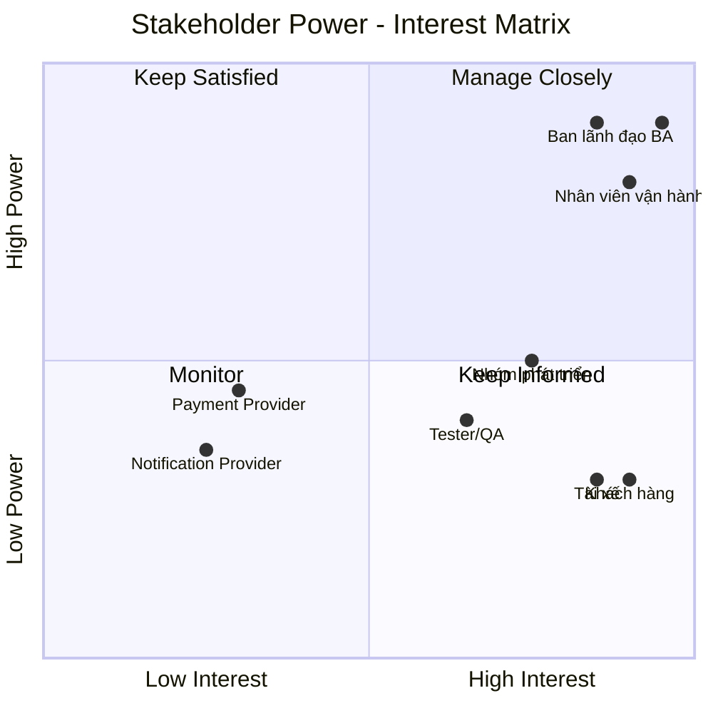

> **Nhận xét:** Nhóm cần BA quan tâm cao nhất là **Ban lãnh đạo – Nhân viên vận hành – Khách hàng – Tài xế**, vì đây là những bên trực tiếp quyết định hoặc sử dụng hệ thống. Tài liệu cũng yêu cầu hệ thống phải hỗ trợ phối hợp giữa các bộ phận và có dữ liệu để theo dõi hoạt động. 

---

# B3. Chuyển đổi yêu cầu khách hàng thành Business Goals – BR

Từ yêu cầu ban đầu, có thể chuyển thành **9 Business Requirements (BR)** cho phạm vi MVP.

| Mã BR | Business Requirement | Mục tiêu nghiệp vụ |
|---|---|---|
| **BR-01** | Quản lý tài khoản khách hàng | Cho phép khách hàng tạo và sử dụng tài khoản trên hệ thống |
| **BR-02** | Quản lý hồ sơ khách hàng | Đảm bảo thông tin khách hàng được cập nhật và quản lý tập trung |
| **BR-03** | Quản lý tài khoản tài xế | Cho phép hệ thống tạo và quản lý tài khoản tài xế |
| **BR-04** | Quản lý hồ sơ và phương tiện tài xế | Quản lý thông tin tài xế và xe mà tài xế sử dụng |
| **BR-05** | Quản lý trạng thái tài xế | Xác định tài xế có thể nhận chuyến hay không |
| **BR-06** | Tạo yêu cầu đặt xe | Cho phép khách hàng nhập điểm đón, điểm đến và tạo yêu cầu |
| **BR-07** | Lựa chọn xe và tài xế | Cho phép khách hàng lựa chọn tài xế và phương tiện phù hợp trong phạm vi MVP |
| **BR-08** | Theo dõi trạng thái yêu cầu/chuyến | Cho phép khách hàng biết tình trạng xử lý yêu cầu |
| **BR-09** | Quản lý lịch sử sử dụng dịch vụ | Lưu lại các yêu cầu/chuyến của khách hàng để tra cứu |

Các BR trên được rút ra từ những yêu cầu về đăng ký, cập nhật thông tin, nhập điểm đón/điểm đến, lựa chọn loại xe, theo dõi tài xế/chuyến và lịch sử chuyến đi trong tài liệu. 

---

# B4. Xác định phạm vi MVP
## 1. Module MVP

### Module 1 – Quản lý khách hàng

Phạm vi:

- Đăng ký tài khoản.
- Đăng nhập.
- Cập nhật thông tin cá nhân.
- Tạo yêu cầu chuyến.
- Nhập điểm đón.
- Nhập điểm đến.
- Lựa chọn loại xe.
- Lựa chọn tài xế phù hợp.
- Theo dõi trạng thái yêu cầu.
- Xem lịch sử yêu cầu/chuyến.

### Module 2 – Quản lý tài xế

Phạm vi:

- Tạo tài khoản tài xế.
- Cập nhật hồ sơ tài xế.
- Quản lý phương tiện.
- Cập nhật trạng thái hoạt động.
- Chuyển sang trạng thái sẵn sàng nhận chuyến.
- Nhận yêu cầu chuyến.
- Chấp nhận/từ chối chuyến.
- Cập nhật trạng thái chuyến.

Tài liệu yêu cầu tài xế có hồ sơ, thông tin phương tiện và trạng thái hoạt động; khi có yêu cầu phù hợp thì tài xế có thể chấp nhận hoặc từ chối.

## 2. Ngoài phạm vi MVP

| Chức năng | MVP |
|---|---|
| Thanh toán điện tử | ❌ |
| Tích hợp Payment Gateway | ❌ |
| Đánh giá tài xế | ❌ |
| Báo cáo doanh thu | ❌ |
| Báo cáo hiệu quả tài xế | ❌ |
| Thuật toán matching nâng cao | ❌ |
| Định vị tài xế theo thời gian thực | ❌ |
| Nhiều nhà cung cấp notification | ❌ |
| Quản lý khiếu nại nâng cao | ❌ |
| Phân tích dữ liệu | ❌ |

Lý do loại khỏi MVP là tài liệu mô tả đây là những năng lực của nền tảng CAB đầy đủ hoặc các yêu cầu phát triển về sau, trong khi MVP được giới hạn để đảm bảo hệ thống hoạt động trước.

---

# B5. Biến đổi thành Business Requirement doanh nghiệp cần

Ở bước này, BR được cụ thể hóa hơn thành **yêu cầu nghiệp vụ có thể dùng để xây dựng hệ thống**.

## BR-01 – Quản lý tài khoản khách hàng

> Doanh nghiệp cần hệ thống cho phép khách hàng đăng ký tài khoản và đăng nhập để sử dụng các chức năng yêu cầu xác thực.

## BR-02 – Quản lý hồ sơ khách hàng

> Doanh nghiệp cần hệ thống cho phép khách hàng xem và cập nhật thông tin cá nhân.

## BR-03 – Quản lý tài khoản tài xế

> Doanh nghiệp cần hệ thống cho phép tạo và quản lý tài khoản tài xế.

## BR-04 – Quản lý tài xế và phương tiện

> Doanh nghiệp cần quản lý thông tin cá nhân của tài xế và thông tin phương tiện mà tài xế sử dụng.

## BR-05 – Quản lý trạng thái tài xế

> Doanh nghiệp cần biết tài xế nào đang sẵn sàng nhận chuyến để cung cấp danh sách tài xế có thể lựa chọn.

## BR-06 – Tạo yêu cầu đặt xe

> Khách hàng cần nhập điểm đón và điểm đến, sau đó tạo yêu cầu đặt xe trên hệ thống.

## BR-07 – Lựa chọn xe và tài xế

> Khách hàng cần được xem danh sách **xe/tài xế đang phù hợp và sẵn sàng**, sau đó lựa chọn tài xế và phương tiện để thực hiện chuyến.
Trong MVP, **không cần đánh giá tài xế tốt/xấu hoặc xây dựng thuật toán xếp hạng phức tạp**. Mục tiêu trước mắt là bảo đảm hệ thống có thể cung cấp danh sách tài xế/xe khả dụng và thực hiện được việc lựa chọn.

## BR-08 – Theo dõi trạng thái

> Khách hàng cần xem trạng thái xử lý của yêu cầu sau khi đặt xe.

Ví dụ:

```text
Đã tạo yêu cầu
      ↓
Đang chờ tài xế
      ↓
Đã có tài xế
      ↓
Đang thực hiện
      ↓
Hoàn thành
```

Tài liệu cũng yêu cầu khách hàng biết hệ thống đang tìm tài xế, tài xế nào nhận chuyến và trạng thái hiện tại.

## BR-09 – Lịch sử chuyến

> Doanh nghiệp cần lưu thông tin yêu cầu/chuyến để khách hàng có thể tra cứu lịch sử sử dụng.

---

# B6. Mô hình hóa nghiệp vụ

Vì có **9 BR**, ta xây dựng **9 quy trình nghiệp vụ tương ứng**.

## Quy trình BR-01 – Đăng ký tài khoản khách hàng

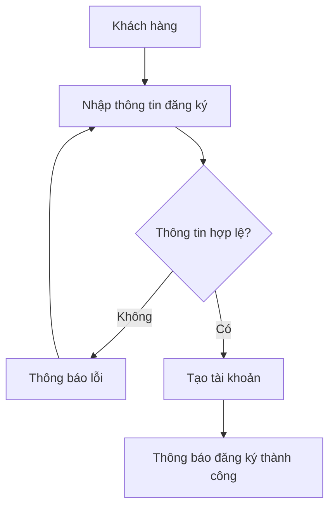

---

## Quy trình BR-02 – Cập nhật hồ sơ khách hàng

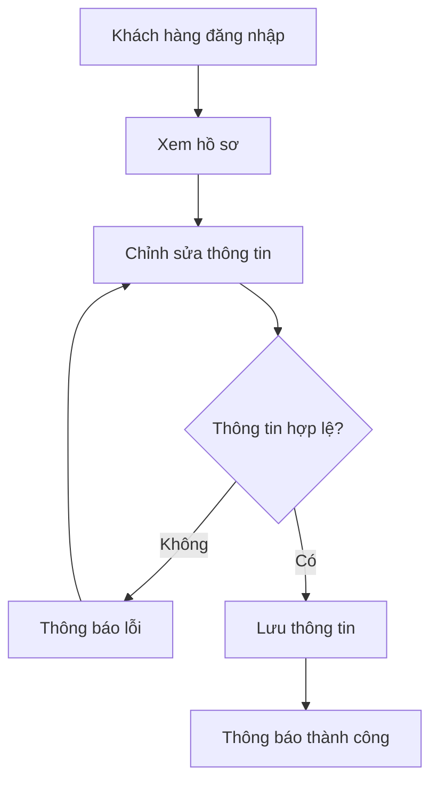

---

## Quy trình BR-03 – Tạo tài khoản tài xế

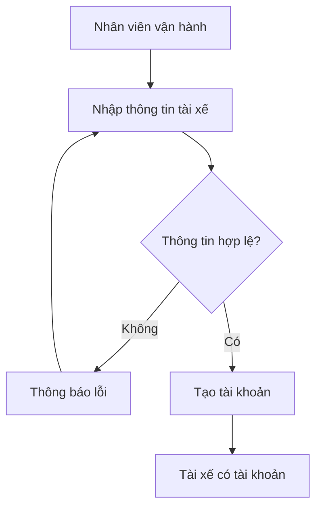

Trong tài liệu, tài xế có thể đăng ký hoặc được nhân viên vận hành tạo tài khoản.

---

## Quy trình BR-04 – Quản lý hồ sơ và phương tiện

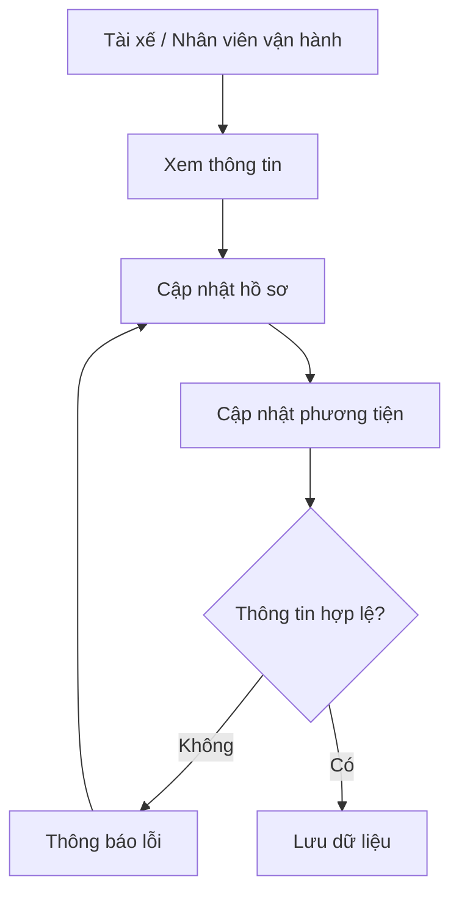

---

## Quy trình BR-05 – Cập nhật trạng thái tài xế

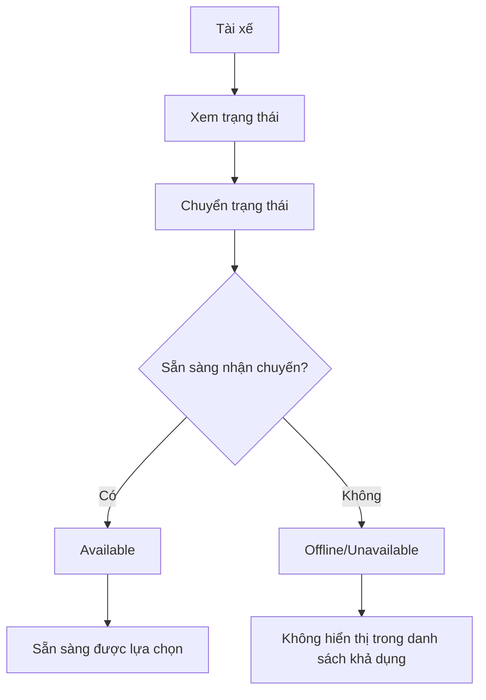

---

## Quy trình BR-06 – Tạo yêu cầu đặt xe

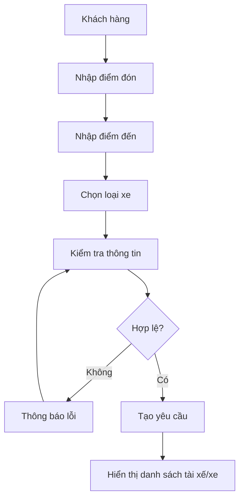

---

## Quy trình BR-07 – Lựa chọn tài xế và xe

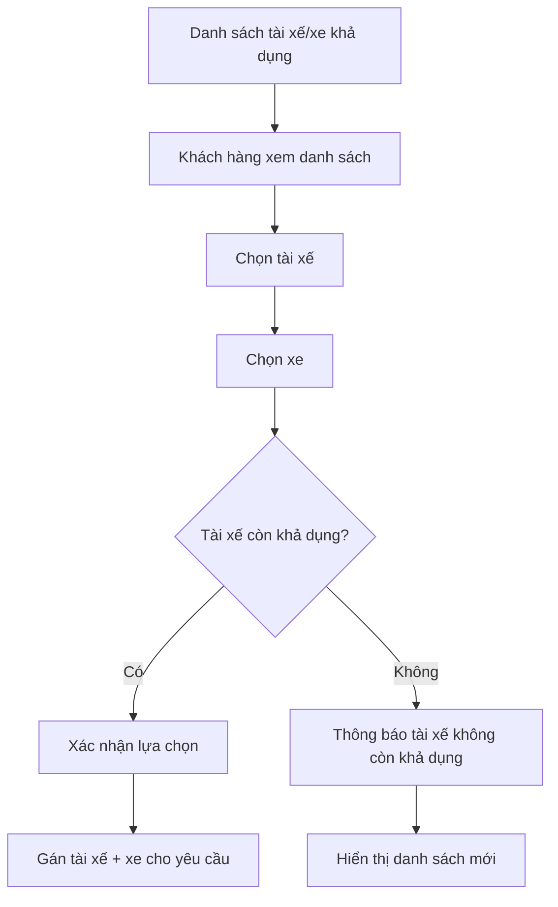

> Đây là điểm **MVP quan trọng**: chưa cần thuật toán tìm tài xế tối ưu; chỉ cần hệ thống xác định được tài xế đang ở trạng thái có thể nhận chuyến và cho khách hàng lựa chọn.

---

## Quy trình BR-08 – Theo dõi trạng thái chuyến

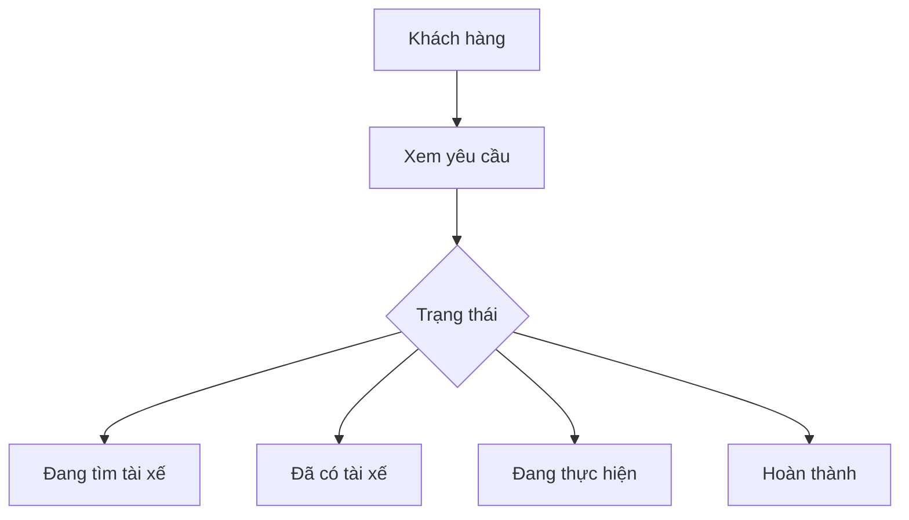

---

## Quy trình BR-09 – Xem lịch sử

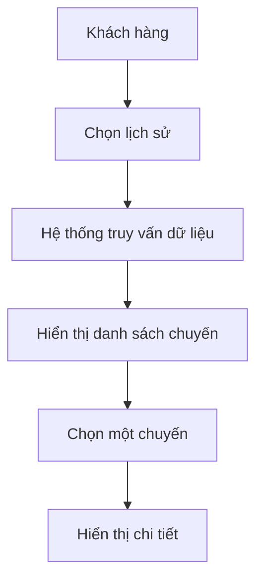

---

# B7. Functional Requirements – FR

## Module 1 – Quản lý khách hàng

| Mã FR | Functional Requirement | BR |
|---|---|---|
| **FR-CUS-01** | Hệ thống cho phép khách hàng đăng ký tài khoản | BR-01 |
| **FR-CUS-02** | Hệ thống cho phép khách hàng đăng nhập | BR-01 |
| **FR-CUS-03** | Hệ thống kiểm tra thông tin đăng nhập | BR-01 |
| **FR-CUS-04** | Hệ thống cho phép khách hàng xem hồ sơ | BR-02 |
| **FR-CUS-05** | Hệ thống cho phép khách hàng cập nhật hồ sơ | BR-02 |
| **FR-CUS-06** | Hệ thống cho phép khách hàng nhập điểm đón | BR-06 |
| **FR-CUS-07** | Hệ thống cho phép khách hàng nhập điểm đến | BR-06 |
| **FR-CUS-08** | Hệ thống cho phép khách hàng chọn loại xe | BR-06 |
| **FR-CUS-09** | Hệ thống cho phép khách hàng tạo yêu cầu đặt xe | BR-06 |
| **FR-CUS-10** | Hệ thống hiển thị danh sách tài xế khả dụng | BR-07 |
| **FR-CUS-11** | Hệ thống hiển thị thông tin phương tiện | BR-07 |
| **FR-CUS-12** | Khách hàng có thể lựa chọn tài xế | BR-07 |
| **FR-CUS-13** | Khách hàng có thể lựa chọn phương tiện | BR-07 |
| **FR-CUS-14** | Hệ thống kiểm tra tài xế còn khả dụng trước khi xác nhận | BR-07 |
| **FR-CUS-15** | Hệ thống hiển thị trạng thái yêu cầu/chuyến | BR-08 |
| **FR-CUS-16** | Hệ thống cho phép khách hàng xem lịch sử chuyến | BR-09 |

## Module 2 – Quản lý tài xế

| Mã FR | Functional Requirement | BR |
|---|---|---|
| **FR-DRV-01** | Tạo tài khoản tài xế | BR-03 |
| **FR-DRV-02** | Cho phép tài xế đăng nhập | BR-03 |
| **FR-DRV-03** | Cho phép tài xế xem hồ sơ | BR-04 |
| **FR-DRV-04** | Cho phép tài xế cập nhật hồ sơ | BR-04 |
| **FR-DRV-05** | Quản lý thông tin phương tiện | BR-04 |
| **FR-DRV-06** | Cho phép tài xế xem trạng thái hiện tại | BR-05 |
| **FR-DRV-07** | Cho phép tài xế chuyển sang trạng thái sẵn sàng | BR-05 |
| **FR-DRV-08** | Hiển thị yêu cầu chuyến phù hợp cho tài xế | BR-07 |
| **FR-DRV-09** | Cho phép tài xế chấp nhận yêu cầu | BR-07 |
| **FR-DRV-10** | Cho phép tài xế từ chối yêu cầu | BR-07 |
| **FR-DRV-11** | Cho phép tài xế cập nhật trạng thái chuyến | BR-08 |

Tài liệu yêu cầu tài xế phải có khả năng cập nhật trạng thái như đã đến điểm đón, đã đón khách, đang di chuyển và hoàn thành chuyến. 

---

# B8. Business Rules – Quy tắc nghiệp vụ

> Đây là phần rất quan trọng vì **FR nói hệ thống làm gì**, còn **Business Rule nói hệ thống phải tuân theo quy tắc nào**.

| Mã Rule | Business Rule |
|---|---|
| **BRULE-01** | Khách hàng phải đăng nhập trước khi tạo yêu cầu đặt xe |
| **BRULE-02** | Email/số điện thoại/tài khoản dùng đăng ký không được trùng với tài khoản đã tồn tại |
| **BRULE-03** | Chỉ tài xế ở trạng thái **Available/Sẵn sàng** mới được hiển thị là tài xế có thể lựa chọn |
| **BRULE-04** | Mỗi yêu cầu chỉ được gán cho một tài xế và một phương tiện tại một thời điểm |
| **BRULE-05** | Tài xế không thể nhận thêm yêu cầu nếu đang thực hiện một chuyến đang hoạt động |
| **BRULE-06** | Khi khách hàng xác nhận tài xế, hệ thống phải kiểm tra lại trạng thái tài xế để tránh chọn tài xế đã được người khác chọn |
| **BRULE-07** | Tài xế phải có phương tiện hợp lệ trước khi được chuyển sang trạng thái sẵn sàng |
| **BRULE-08** | Chỉ tài xế được gán cho chuyến mới được phép cập nhật trạng thái chuyến đó |
| **BRULE-09** | Tài khoản đã bị khóa/ngừng hoạt động không được đăng nhập sử dụng chức năng yêu cầu tài khoản |
| **BRULE-10** | Các thao tác thay đổi thông tin quan trọng phải được lưu vết |

Một số rule như thời gian tài xế phải phản hồi, chính sách hủy, mất kết nối, cách tính cước và thời gian lưu trữ **chưa được khách hàng chốt trong tài liệu**, vì vậy cần ghi nhận là **Pending BA Clarification**, không nên tự ý xem là yêu cầu chính thức. 

---
# B9. Non-Functional Requirements – Nghiệp vụ phi chức năng

| Mã NFR | Yêu cầu phi chức năng |
|---|---|
| **NFR-01** | **Performance:** hệ thống phải phản hồi nhanh đối với các thao tác đăng nhập, xem hồ sơ và tạo yêu cầu |
| **NFR-02** | **Availability:** hệ thống phải hoạt động ổn định trong thời điểm nhu cầu tăng cao |
| **NFR-03** | **Security:** các chức năng yêu cầu tài khoản phải xác thực người dùng |
| **NFR-04** | **Authorization:** chức năng quản trị phải kiểm soát quyền truy cập |
| **NFR-05** | **Data Protection:** thông tin cá nhân, thông tin phương tiện và dữ liệu giao dịch phải được bảo vệ |
| **NFR-06** | **Auditability:** các thao tác quan trọng phải được lưu vết |
| **NFR-07** | **Scalability:** các thành phần hệ thống có khả năng mở rộng khi tải tăng |
| **NFR-08** | **Maintainability:** có thể triển khai chức năng mới từng phần mà hạn chế ảnh hưởng đến chức năng đang hoạt động |
| **NFR-09** | **Extensibility:** kiến trúc phải cho phép bổ sung loại dịch vụ, phương thức thanh toán và nhà cung cấp thông báo trong tương lai |

Các yêu cầu này xuất phát trực tiếp từ phần ổn định, mở rộng, bảo mật và khả năng phát triển lâu dài trong tài liệu.

---

# B10. ERD – Entity Relationship Diagram

## 1. Entity chính

| Entity | Ý nghĩa |
|---|---|
| **CUSTOMER** | Lưu thông tin khách hàng |
| **DRIVER** | Lưu tài khoản và thông tin tài xế |
| **VEHICLE** | Lưu thông tin phương tiện |
| **RIDE_REQUEST** | Lưu yêu cầu đặt xe |
| **DRIVER_STATUS_HISTORY** | Lưu lịch sử thay đổi trạng thái tài xế |

## 2. Mermaid ERD

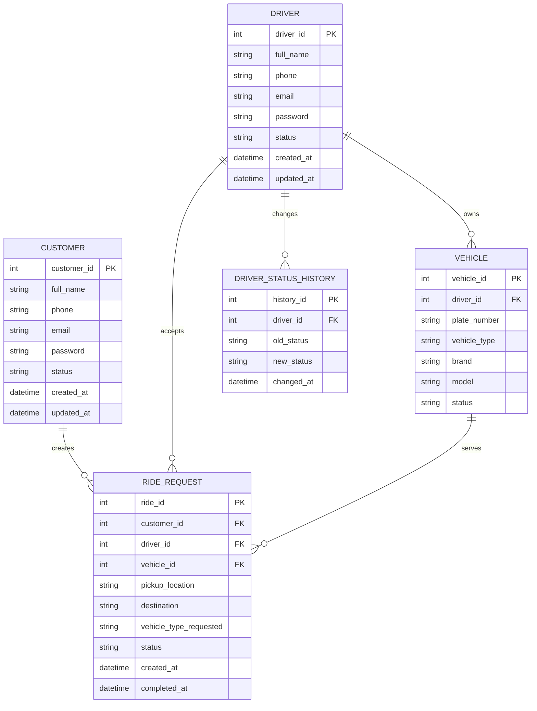

### Quan hệ chính

```text
CUSTOMER 1 ---- N RIDE_REQUEST

DRIVER   1 ---- N VEHICLE

DRIVER   1 ---- N RIDE_REQUEST

VEHICLE  1 ---- N RIDE_REQUEST

DRIVER   1 ---- N DRIVER_STATUS_HISTORY
```

> `RIDE_REQUEST` rất quan trọng dù đề bài chỉ có 2 module, bởi vì nó là entity trung gian giúp kết nối **khách hàng → tài xế → xe**, phục vụ trực tiếp chức năng khách hàng lựa chọn tài xế và xe.

---

# B11. Thiết kế Use Case

## 1. Use Case Diagram tổng quát

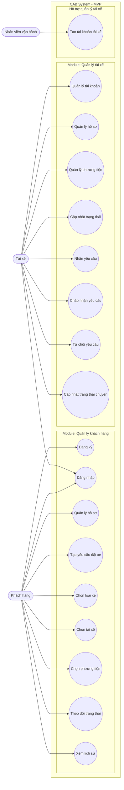

---

## 2. Use Case chính: Khách hàng lựa chọn tài xế và xe

### UC-CUS-06 – Lựa chọn tài xế

| Thành phần | Nội dung |
|---|---|
| **Actor** | Khách hàng |
| **Pre-condition** | Khách hàng đã đăng nhập và đã tạo yêu cầu |
| **Input** | Yêu cầu chuyến, loại xe |
| **Main flow** | Hiển thị tài xế khả dụng → khách hàng xem thông tin → chọn tài xế → hệ thống kiểm tra lại trạng thái → xác nhận |
| **Alternative flow** | Tài xế không còn khả dụng → thông báo → hiển thị danh sách mới |
| **Post-condition** | Tài xế được gán cho yêu cầu |

---

## 3. Use Case chính: Tài xế chuyển trạng thái

### UC-DRV-13 – Cập nhật trạng thái

| Thành phần | Nội dung |
|---|---|
| **Actor** | Tài xế |
| **Pre-condition** | Tài xế đăng nhập |
| **Main flow** | Tài xế mở trạng thái → chọn Available → hệ thống kiểm tra điều kiện → cập nhật |
| **Alternative flow** | Không đủ điều kiện → hệ thống từ chối |
| **Post-condition** | Tài xế được đưa vào/loại khỏi danh sách có thể nhận chuyến |

---

# B12. Acceptance Criteria – AC

Acceptance Criteria dùng để xác định **khi nào FR được xem là hoàn thành và đủ điều kiện nghiệm thu**.

| AC | FR liên quan | Tiêu chí chấp nhận |
|---|---|---|
| **AC-01** | FR-CUS-01 | Nhập đầy đủ dữ liệu hợp lệ → tài khoản được tạo thành công |
| **AC-02** | FR-CUS-02 | Tài khoản và mật khẩu đúng → đăng nhập thành công |
| **AC-03** | FR-CUS-03 | Sai thông tin → hệ thống không cho đăng nhập và hiển thị thông báo |
| **AC-04** | FR-CUS-05 | Thay đổi thông tin hợp lệ → dữ liệu mới được lưu |
| **AC-05** | FR-CUS-06/07 | Điểm đón và điểm đến được nhập và lưu cùng yêu cầu |
| **AC-06** | FR-CUS-08 | Khách hàng có thể chọn một loại xe được hệ thống hỗ trợ |
| **AC-07** | FR-CUS-09 | Đủ thông tin → yêu cầu đặt xe được tạo với trạng thái ban đầu |
| **AC-08** | FR-CUS-10 | Chỉ tài xế Available mới xuất hiện trong danh sách lựa chọn |
| **AC-09** | FR-CUS-11 | Danh sách hiển thị được thông tin phương tiện tương ứng |
| **AC-10** | FR-CUS-12/13 | Khách hàng có thể chọn một tài xế và phương tiện |
| **AC-11** | FR-CUS-14 | Tài xế chuyển sang unavailable trước khi xác nhận → hệ thống từ chối lựa chọn |
| **AC-12** | FR-CUS-15 | Khi tài xế nhận chuyến, trạng thái khách hàng nhìn thấy được cập nhật |
| **AC-13** | FR-CUS-16 | Khách hàng có thể xem danh sách lịch sử của chính mình |
| **AC-14** | FR-DRV-01 | Tài khoản tài xế được tạo với dữ liệu hợp lệ |
| **AC-15** | FR-DRV-04 | Tài xế cập nhật hồ sơ → thông tin mới được lưu |
| **AC-16** | FR-DRV-05 | Thông tin xe được gắn với đúng tài xế |
| **AC-17** | FR-DRV-07 | Tài xế đủ điều kiện → có thể chuyển sang Available |
| **AC-18** | FR-DRV-09 | Tài xế chấp nhận → yêu cầu được gán cho tài xế |
| **AC-19** | FR-DRV-10 | Tài xế từ chối → yêu cầu vẫn tồn tại và có thể xử lý tiếp |
| **AC-20** | FR-DRV-11 | Tài xế thay đổi trạng thái chuyến → trạng thái được lưu và hiển thị cho khách hàng |

---

# B13. Traceability Matrix – Bảng truy vết

Đây là bảng dùng để kiểm soát xem **yêu cầu khách hàng → BR → quy trình → FR → AC** có bị bỏ sót hay không.

| BR | Business Process | FR | AC | Trạng thái MVP |
|---|---|---|---|---|
| **BR-01** | Đăng ký/đăng nhập khách hàng | FR-CUS-01 → FR-CUS-03 | AC-01 → AC-03 | ✅ |
| **BR-02** | Quản lý hồ sơ | FR-CUS-04 → FR-CUS-05 | AC-04 | ✅ |
| **BR-03** | Tạo/quản lý tài khoản tài xế | FR-DRV-01 → FR-DRV-02 | AC-14 | ✅ |
| **BR-04** | Quản lý hồ sơ & xe | FR-DRV-03 → FR-DRV-05 | AC-15 → AC-16 | ✅ |
| **BR-05** | Quản lý trạng thái | FR-DRV-06 → FR-DRV-07 | AC-08, AC-17 | ✅ |
| **BR-06** | Tạo yêu cầu đặt xe | FR-CUS-06 → FR-CUS-09 | AC-05 → AC-07 | ✅ |
| **BR-07** | Chọn tài xế & xe | FR-CUS-10 → FR-CUS-14, FR-DRV-08 → FR-DRV-10 | AC-08 → AC-11, AC-18 → AC-19 | ✅ |
| **BR-08** | Theo dõi trạng thái | FR-CUS-15, FR-DRV-11 | AC-12, AC-20 | ✅ |
| **BR-09** | Lịch sử chuyến | FR-CUS-16 | AC-13 | ✅ |

## Ma trận truy vết tổng quát

```text
Customer Requirement
        ↓
       BR
        ↓
 Business Process
        ↓
       FR
        ↓
       AC
        ↓
  Nghiệm thu MVP
```

Ví dụ:

```text
"Khách hàng muốn lựa chọn tài xế"
            ↓
         BR-07
            ↓
  Quy trình lựa chọn tài xế
            ↓
   FR-CUS-10 → FR-CUS-14
            ↓
      AC-08 → AC-11
            ↓
       Nghiệm thu
```

---

# B14. Test Case

**Chưa thực hiện ở giai đoạn này**, đúng với yêu cầu đề bài.

Quy trình triển khai sau này sẽ là:

```text
BR
 ↓
Business Process
 ↓
FR
 ↓
Business Rule
 ↓
NFR
 ↓
Use Case
 ↓
Acceptance Criteria
 ↓
Test Case
```

---

# Tổng hợp phạm vi MVP

## Module 1 – Quản lý khách hàng

```text
Đăng ký
   ↓
Đăng nhập
   ↓
Quản lý hồ sơ
   ↓
Tạo yêu cầu
   ↓
Nhập điểm đón / điểm đến
   ↓
Chọn loại xe
   ↓
Chọn tài xế
   ↓
Chọn phương tiện
   ↓
Theo dõi trạng thái
   ↓
Xem lịch sử
```

## Module 2 – Quản lý tài xế

```text
Tài khoản
   ↓
Hồ sơ
   ↓
Phương tiện
   ↓
Trạng thái hoạt động
   ↓
Available
   ↓
Nhận yêu cầu
   ↓
Chấp nhận / Từ chối
   ↓
Cập nhật trạng thái chuyến
```

## Những gì MVP **không tập trung**

```text
Thanh toán
Đánh giá tài xế
Báo cáo doanh thu
Thuật toán matching nâng cao
Định vị GPS thời gian thực
Notification đa kênh
Phân tích hiệu quả tài xế
```

Điều này giữ đúng tinh thần **“giai đoạn này không cần tài xế tốt mà chỉ cần hệ thống hoạt động”**: MVP ưu tiên chứng minh được luồng nghiệp vụ cốt lõi **Khách hàng → Yêu cầu → Xe/Tài xế → Chuyến**, thay vì cố xây dựng ngay một hệ thống CAB hoàn chỉnh. Tài liệu gốc cũng xác định mục tiêu dài hạn là một nền tảng có thể phát triển thêm tính năng, trong khi BA phải làm rõ các điểm chưa chốt trước khi nhóm phát triển triển khai. 

### Các điểm cần BA xác nhận trước khi khóa yêu cầu

| Nội dung | Tình trạng |
|---|---|
| Cách tính cước | **Chưa chốt** |
| Tiêu chí ưu tiên tài xế | **Chưa chốt** |
| Thời gian tài xế phản hồi | **Chưa chốt** |
| Chính sách hủy chuyến | **Chưa chốt** |
| Xử lý mất mạng | **Chưa chốt** |
| Thời gian lưu trữ dữ liệu | **Chưa chốt** |

Đây là các điểm được tài liệu nêu rõ là doanh nghiệp hiện chưa chốt và cần BA làm rõ với stakeholder.
